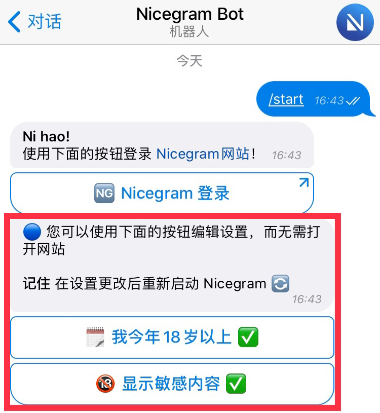
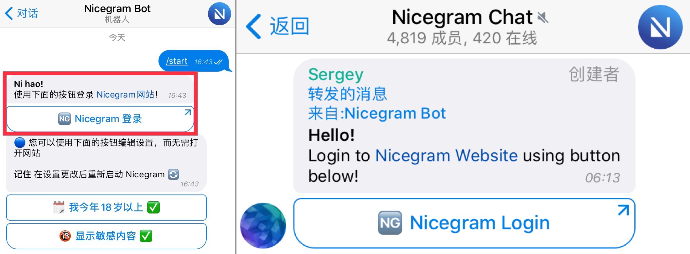

# Nicegram 受限群组/频道解除限制教程
_被图中的提示所困扰？Nicegram 能够帮得上您。_

您能在 Nicegram 中进入因受限而不可用的群组/频道。
依据 [App Store 审核指南][app-store-guidelines]，您只能在 Nicegram 的本体之外进行解锁操作。

目前有**三种**方法可供您选择。

该教程仅对 **Nicegram** 及更高版本有效！如果您还在使用老版本，请 [从 App Store 中下载或更新 Nicegram][nicegram-app-store]。
> ⚠️注意：中国大陆地区 App Store 无法下载，请移步[美国区](https://apps.apple.com/us/app/id1608870673)或中国港澳台地区（[香港区](https://apps.apple.com/hk/app/id1608870673)、[澳门区](https://apps.apple.com/mo/app/id1608870673)、[台湾区](https://apps.apple.com/app/apple-store/id1608870673?pt=119567154&ct=nicegram.app&mt=8)）App Store。

该教程仅对 **Nicegram** 及更高版本有效！如果您还在使用老版本，请 [从 Google Play 中下载或更新 Nicegram][nicegram-google-play]
> [⚠️注意：中国大陆地区 Google Play 无法下载](https://play.google.com/store/apps/details?id=app.nicegram&utm_source=nicegram.app&utm_medium=main&utm_campaign=web)

## 1. 通过 Telegram 机器人

1.   在任意 Telegram 官方 App（包括 [Telegram 网页版](https://web.telegram.org)）中使用 [Nicegram 机器人（@Nicegram_bot）](https://t.me/nicegram_bot)。**⚠️注意：依据 [App Store 审核指南][app-store-guidelines]，无法在 Nicegram 中直接使用该机器人！**
2.   点击按钮，使得两个按钮中的“❌”都变为“✅”，即可更改您的设置。
3.   [重启 Nicegram][force-close]（结束进程并重新打开 App）。

> 该机器人**只能**在 Telegram 官方 App 或 [Telegram 网页版](https://web.telegram.org) 中使用。

## 2. 通过 Nicegram 网站

1.   访问 [https://my.nicegram.app](https://my.nicegram.app/)。
2.   使用“Login with Telegram”组件登录。
     **⚠️注意：Nicegram 网站并不会获取您的私人数据，例如您的手机号或是您的聊天消息。**
3.   拨动开关，即可更改您的设置。
4.   点击“Save”按钮保存。
5.   [重启 Nicegram][force-close]（结束进程并重新打开 App）。

> Nicegram 网站仅能获取到您的姓名、用户名和头像。

> 设置已保存。记得 [重启 Nicegram][force-close]！

## 3. 通过 Nicegram 网站与机器人

_如果网站上的 Telegram 登录组件无效，那么这个方法应该有用。_

1.   在①②中任选其一进行操作：
        ① 在 Telegram 官方 App 或网页版中使用 [Nicegram 机器人（@Nicegram_bot）](https://t.me/nicegram_bot) 。**⚠️注意：依据 [App Store 审核指南][app-store-guidelines]，无法在 Nicegram 中直接使用这个机器人！**
        ② 打开这条带有登录按钮的消息：[https://t.me/nicegramchat/35207](https://t.me/nicegramchat/35207)。
2.   点击“🆖 Nicegram Login”按钮，立即登录到网站。
3.   更改设置并保存。
4.   [重启 Nicegram][force-close]（结束进程并重新打开 App）。

> 在 Telegram 中使用机器人，或是跳转到这条带有登录按钮的消息

### 补充说明

* 这些设置仅对单个账号生效。**如果您正在使用多个账号** 且希望在所有账号中都能查看敏感内容，**您需要为每个账号都重复以上操作。**
* 在新版本中，已不再使用老版本中的“Nicegram Debug”功能来解锁，所以您没必要再去快速点击设置图标调出它了。Nicegram 在启动时会自动同步并加载您在网站上的解锁设置。
* 某些会话可能会被 Telegram 全区永久封禁，这种情况下回天乏术，无法解除限制。
* 来自中国大陆、印度、哈萨克斯坦、乌兹别克斯坦以及其他地区的用户可能会面临**锁区**。为了进入被锁区的会话，您需要使用未锁区地区的手机号来创建 Telegram 账号。对此有一种解决方法，就是使用 <abbr title="Voice over Internet Protocol">VoIP</abbr> 号码。至于怎么弄，[Google 一下你就知道](https://www.google.com/search?q=voip+number+for+telegram)。下图展示了被锁区的会话看上去会是什么样：
	
* 如果您是一个被锁区的聊天群组/机器人/频道的创建者, 请直接去联系 Telegram 的客服，请求他们帮您解除。来找 Nicegram 开发组只会浪费彼此的时间。 

### 特殊情况：“在 Nicegram 中不可用”

依据 [App Store 审核指南][app-store-guidelines]，就算是在 Nicegram 中，有些会话也不可用。这些会话在受限时，会显示“在 Nicegram 中不可用”。

> 对此我很抱歉，但是我也没有任何办法能够解决。

---

喜欢这些功能吗？您可以在 [Patreon 平台](https://patreon.com/nicegram) 上赞助 Nicegram！

下载 [App Store 中的 Nicegram][nicegram-app-store]
> ⚠️注意：中国大陆地区 App Store 无法下载，请移步[美国区](https://apps.apple.com/us/app/id1608870673)或中国港澳台地区（[香港区](https://apps.apple.com/hk/app/id1608870673)、[澳门区](https://apps.apple.com/mo/app/id1608870673)、[台湾区](https://apps.apple.com/app/apple-store/id1608870673?pt=119567154&ct=nicegram.app&mt=8)）App Store。

下载 [Google Play 中的 Nicegram][nicegram-google-play]
>> ⚠️注意：[中国大陆地区 App Store 无法下载](https://play.google.com/store/apps/details?id=app.nicegram&utm_source=nicegram.app&utm_medium=main&utm_campaign=web)

[了解更多 Nicegram 功能](/cn/features)

别忘了订阅 [Nicegram 官方频道（@nicegramapp)](https://t.me/nicegramapp) 以获取最新的更新信息并深入了解这款 App。加入 [Nicegram 中文群组（@nicegram_cn)](https://t.me/nicegram_cn)，和大家一起交流探讨。您有些什么关于新功能的**好点子**也可以在群组里分享给我们。

[app-store-guidelines]: https://developer.apple.com/cn/app-store/review/guidelines/#user-generated-content
[nicegram-app-store]: https://apps.apple.com/app/apple-store/id1608870673?pt=119567154&ct=nicegram.app&mt=8
[nicegram-google-play]: https://play.google.com/store/apps/details?id=app.nicegram&utm_source=nicegram.app&utm_medium=main&utm_campaign=web
[force-close]: https://support.apple.com/zh-cn/HT201330
