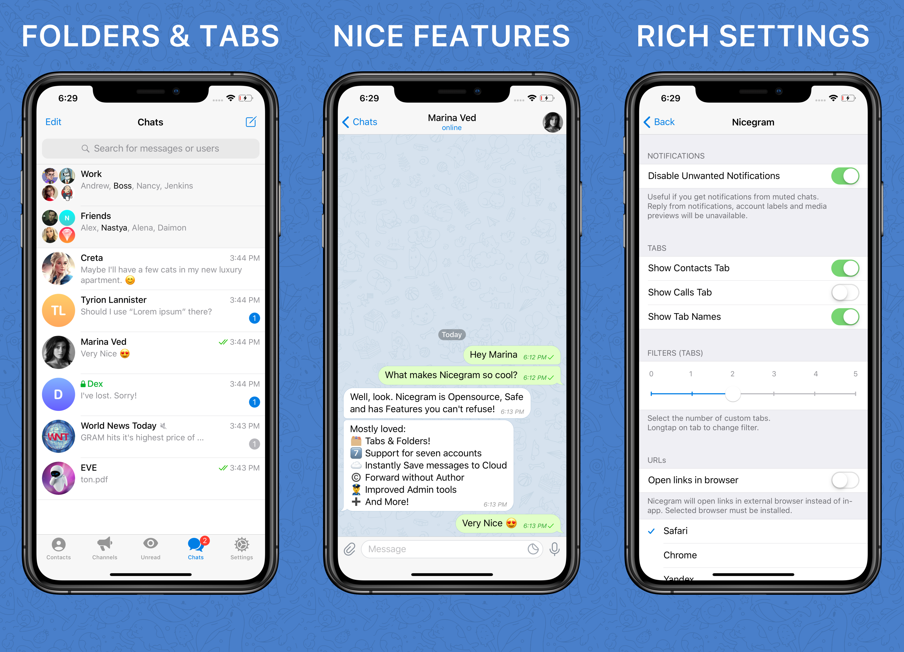

# Conoce Nicegram

Bienvenido a Nicegram

App de mensajeria rapida y segura: Imagina la mezcla de la poderosa **API de Telegram**, **cuidadosa optimizacion de codigo** y caracteristicas **unicas** que no puedes rechazar!

## Nicegram te devuelve la joya de la comunicacion pura:

- **Olvidate de la censura innecesaria** Ya no vas a tener que lidiar con situaciones donde alguien sabe mejor con que grupos, canales o bots debes interactuar. [Descubre mas](/es/unblock)

- **Enfocate mas con las carpetas y pestañas.** Agrupa los grupos por los topicos que quieras, o separalos por tipos - canales, bots, chats privados y mas. Se mas productivo con la mensajeria!. Para crear carpeta: Esquina superior izquierda - **Editar > Nueva carpeta**

- **Reenviar sin autor**

- **Esconde las pestañas que no usas** Decide si quieres mostrar las pestañas de llamadas y contactos al final de la app.

- **Cambia hasta entre siete cuentas.** Multiples cuentas ahora significa mas que tres, alfo que esta limitado una app estandar de Telegram.

- **Guarda mensajes instantaneamente** a tu nube con un simple toque.

- **Pierde una mensaje anclado, pero no para siempre.** Recuperar un mensaje anclado en cualquier chat, ahora es posible.
Eres un admin y quieres deshacerte de ese mensaje anclado que juega con tus nervios?. Ahora puedes esconderlo para ti, no para todos los otros miembros.

- **Administra como el p*to amo.** Restringe usuarios mas rapido que una bala. Manten presionado el mensaje y entra directamente al menu de excepciones. Controla la excepcion hasta el segundo.

- **Nicegram no es solo buena, sino que tambien es segura de usar.** No tomes mi palabra solamente. Ve y revisa el codigo fuente por ti mismo en: [https://github.com/nicegram](https://github.com/nicegram)

### Nicegram tambien provee estas caracteristicas:
- "Skip read history" - No enviar el status de leido en los chats. Se activa via Debug menu, toca 15 veces en el icono de ajustes, desliza hacia abajo.
- Confirmacion antes de iniciar un chat secreto, al compartir tu info. de contacto o una llamada
-  Traducciones para chino simplificado y tradicional incuidos en la app.
- Copia texto "monospace" en un toque (como en Android)
- Abre links en navegadores externos: Chrome, Yandex, DuckDuckGo, Alook, Opener y mas
- Cualquier link, nombre de usuario, numeros de telefonos pueden ser presionados en la biografia de un usuario
- Muestra el ID en la informacion del chat. Toca el ID para copiarlo
- Esconde tu numero de telefono en el menu de ajustes
- Esconde los canales patrocinados del proxy (Si, esta disponible en la app oficial tambien, pero Nicegram lo hace mas facil)

Te gusta mucho esta caracteristica?

Puedes donar a Nicegram usando nuestro [Patreon](https://patreon.com/nicegram)

Descarga [Nicegram en la App Store](https://itunes.apple.com/app/id1457369322)

Mas [Caracteristicas de Nicegram](/es/features)

No te ovlvides de suscribir al [canal oficial de Nicegram](https://t.me/nicegramapp) para las ultimas actualizaciones. Unete al chat oficial de [Nicegram Español](https://t.me/nicegram_es) para discutir tus sugerencias acerca de nuevas caracteristicas.
