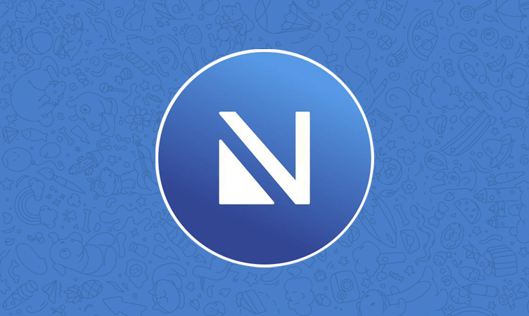

# FAQ di Nicegram

_Qui molto probabilmente troverai le risposte alle domande più frequenti su Nicegram, un'applicazione Telegram modificata per iOS.  Se non hai trovato la risposta alla tua domanda, chiedici su_ [_@nicegram_it_](https://t.me/nicegram_it).

## Indice

* [Caratteristiche di Nicegram](#caratteristiche-di-nicegram)
* [Scarica](#Scarica)
* [Chat e canali internazionali](#chat-e-canali-internazionali)
* [Come faccio ad accedere alle chat bloccate?](#come-faccio-ad-accedere-alle-chat-bloccate)
* [Perché la funzione di debug non funziona più?](#perche-la-funzione-di-debug-non-funziona-piu)
* [Come faccio a riavviare Nicegram?](#come-faccio-a-riavviare-nicegram)
* [Come posso suggerire una nuova funzione?](#come-posso-suggerire-una-nuova-funzione)
* [Come faccio a segnalare un bug su Nicegram?](#come-faccio-a-segnalare-un-bug-su-nicegram)
* [Perché non riesco a vedere le anteprime delle immagini nelle notifiche o a rispondere alle notifiche?](#perche-non-riesco-a-vedere-le-anteprime-delle-immagini-nelle-notifiche-o-a-rispondere-alle-notifiche)
* [Come posso ottenere Nicegram per macOS?](#come-posso-ottenere-nicegram-per-macos)
* [Come posso ottenere Nicegram per Android?](#come-posso-ottenere-nicegram-per-android)
* [Perché non posso unirmi alla beta TestFlight?](#perche-non-posso-unirmi-alla-beta-testflight)
* [Perché sono stato rimosso dalla beta TestFlight?](#perche-sono-stato-rimosso-dalla-beta-testflight)
* [Quando si aggiornerà Nicegram?](#quando-si-aggiornera-nicegram)
* [Informativa sulla privacy](#informativa-sulla-privacy)
* [Codice sorgente](#codice-sorgente)
* [Traduci Nicegram](#traduci-nicegram)
* [Dona](#dona)

## Caratteristiche di Nicegram

* Tab configurabili per filtrare le vostre chat: Admin, Bot, Canali, Gruppi, Utenti, Non letti, Non mutati
* Cartelle per le chat
* Inoltro senza firma
* Sblocca le chat e i canali bloccati
* Nascondi le tab non utilizzate
* Fino a 7 account
* Conferma prima di iniziare una chat segreta, condividere le informazioni di un contatto e chiamare
* Traduzioni in cinese semplificato e tradizionale integrate
* Aprire i link nei browser esterni: Chrome, Yandex, DuckDuckGo, Alook e altro ancora

Per ulteriori caratteristiche, date un'occhiata alle [feature di Nicegram](/it/features)!

> [_Torna su_](#indice)

## Scarica

* App Store: [https://apps.apple.com/app/apple-store/id1608870673](https://apps.apple.com/app/apple-store/id1608870673?pt=119567154&ct=nicegram.app&mt=8)
*   Google Play: [https://play.google.com/store/apps/details?id=app.nicegram](https://play.google.com/store/apps/details?id=app.nicegram&utm_source=nicegram.app&utm_medium=main&utm_campaign=web)
* TestFlight (beta): [https://testflight.apple.com/join/e07wV6pl](https://testflight.apple.com/join/e07wV6pl)
* `.ipa` (solo jailbreak): [https://t.me/joinchat/AAAAAFZneJeI_zyyNQ3ovQ](https://t.me/joinchat/AAAAAFZneJeI_zyyNQ3ovQ)

> [_Torna su_](#indice)

## Chat e canali internazionali

L'elenco si trova su una pagina separata: [elenco delle chat e dei canali Nicegram](/it/chats)

> [_Torna su_](#indice)

## Come faccio ad accedere alle chat bloccate?

Segui la [guida allo sblocco](/it/unblock) per accedere alle chat bloccate.

> [_Torna su_](#indice)

## Perché la funzione di debug non funziona più?

Apple lo ha scoperto e ha costretto Nicegram a rimuoverlo per rispettare le [linee guida dell'App Store](https://developer.apple.com/app-store/review/guidelines/).

Invece, si prega di seguire la [guida allo sblocco](/it/unblock) per accedere alle chat bloccate.

> [_Torna su_](#indice)

## Come faccio a riavviare Nicegram?

[Chiudila forzatamente](https://support.apple.com/it-it/HT201330) (scorri verso l'alto l'app) e poi riaprila.

> [_Torna su_](#indice)

## Come posso suggerire una nuova funzione?

Vai su <https://vote.nicegram.app/>.

Guarda le richieste approvate e quelle respinte prima di scrivere la tua. Non suggerire duplicati!

Metti mi piace alle funzionalità che vuoi vedere in Nicegram.

Qualsiasi funzione che viola i [termini di servizio delle API Telegram](https://core.telegram.org/api/terms) (stato online nascosto, visualizzazione dei messaggi cancellati) o le [linee guida dell'App Store](https://developer.apple.com/app-store/review/guidelines/) saranno respinte!

> [_Torna su_](#indice)

## Come faccio a segnalare un bug su Nicegram?

La maggior parte dei bug in Nicegram sono anche bug dell'app ufficiale di Telegram. **Accettiamo solo segnalazioni di bug per le funzioni relative a Nicegram, come cartelle e schede.**

Ci sono alcuni bug che Nicegram non può risolvere:

* Non è possibile vedere le anteprime delle immagini nelle notifiche o a rispondere alle notifiche ([work-around](#perche-non-riesco-a-vedere-le-anteprime-delle-immagini-nelle-notifiche-o-a-rispondere-alle-notifiche))
* **Crash casuali**
* Le chiamate audio non funzionano in backgroud
* "Aggiornamento..." per molto tempo
* Non vengono aggiornate le chat in background
* La posizione live non si aggiorna in backround
* Mancato invio di messaggi in background
* Le notifiche non scompaiono se il messaggio viene letto o cancellato
* "Connessione..." per sempre, anche se l'applicazione ufficiale è OK (si può provare a utilizzare un proxy)
* Impossibile lasciare la chat dalla schermata delle informazioni della chat

Se il problema che avete trovato non è elencato sopra, inviate un messaggio sulla [chat italiana di Nicegram](https://t.me/nicegram_it) con tutte le informazioni elencate qui sotto.

1. L'hashtag **#bug**.
2. Una breve ma **completa descrizione** del bug. (Puoi anche includere un video o una foto che dimostri il bug, se pensi che possa essere d'aiuto).
3. Quale **versione di iOS** stai usando (13.1.3, 12.4.1, ecc.).
4. Quale **versione di Nicegram** stai usando (5.11, 5.10, ecc.).
5. Quale **numero di Nicegram** stai usando (66, ecc.).

Potete trovare la versione e il numero di build di Nicegram toccando l'ingranaggio delle impostazioni 10 volte velocemente e poi scorrendo fino alla parte inferiore dello schermo. Dovreste vedere `com.nicegram.Telegram-iOS` e `X.XX (YY)`.

`X.XX` è il numero della versione. `(YY)` è il numero della build.

> [_Torna su_](#indice)

## Perché non riesco a vedere le anteprime delle immagini nelle notifiche o a rispondere alle notifiche?

Ci sono dei bug nei server di Telegram che appaiono solo quando si utilizza un'applicazione non ufficiale come Nicegram. Uno di questi bug è particolarmente fastidioso: riceverai una notifica push che dice "Hai un nuovo messaggio!" ogni volta che qualcuno invia un messaggio in un gruppo in cui ti trovi, anche se il gruppo è silenziato. Per aggirare questo problema, Nicegram ha un'impostazione (che ha come impostazione predefinita `on`) chiamata "Disabilita notifiche indesiderate". A causa del modo in cui funzionano le risposte alle notifiche e le anteprime delle notifiche, la disabilitazione di queste notifiche potenzialmente indesiderate disabilita anche queste funzioni.

Se non ti preoccupano le notifiche extra, puoi disattivare questa impostazione in **Impostazioni Nicegram → Nicegram → Disabilita notifiche indesiderate**. Sarà quindi necessario riavviare il telefono affinché l'impostazione abbia effetto. (Si tratta di ottenere una nuova configurazione per il servizio Apple Push Notification Service, che Apple invia ogni ora o al riavvio).

> [_Torna su_](#indice)

## Come posso ottenere Nicegram per macOS?

Nicegram non è disponibile per macOS. Tuttavia, è possibile utilizzare [Telegram per MacOS](https://telegram.org/macos). La versione non dell'App Store non ha restrizioni sui contenuti sensibili.

> [_Torna su_](#indice)

## Come posso ottenere Nicegram per Android?

Nicegram era generalmente disponibile per iOS, ma nel 2021 abbiamo introdotto Nicegram per Android. Potrebbe essere privo di alcune caratteristiche al momento, ma ti piacerà sicuramente! Scaricalo [dal Play Store](https://play.google.com/store/apps/details?id=app.nicegram).

> [_Torna su_](#indice)

## Perché non posso unirmi alla beta TestFlight?

Le beta di TestFlight sono limitate a 10.000 tester. È molto probabile che tutti gli slot beta siano pieni. Se dopo qualche giorno non si sono aperti nuovi slot, dichiarate gentilmente nella [Nicegram Chat](https://t.me/nicegramchat) che la beta di TestFlight è piena e che volete partecipare. Lo sviluppatore cancellerà i beta tester che non hanno aggiornato l'app di recente, in modo che nuovi tester possano partecipare.

> [_Torna su_](#indice)

## Perché sono stato rimosso dalla beta TestFlight?

Gli slot beta per Nicegram sono molto richiesti. Se non hai aggiornato la tua copia beta di Nicegram di recente, lo sviluppatore ti rimuoverà in modo che altri tester possano unirsi alla beta.

> [_Torna su_](#indice)

## Quando si aggiornerà Nicegram?

Nicegram è per lo più una copia dell'app ufficiale di Telegram. Tuttavia, gli sviluppatori che creano l'app ufficiale cambiano spesso la loro versione in modi che rompono le funzionalità di Nicegram. Non pensiamo che lo facciano apposta, scrivere app è difficile. Il nostro sviluppatore fa del suo meglio per assicurarsi che le nuove modifiche all'app ufficiale Telegram vengano incorporate in Nicegram il più velocemente possibile.

Basta avere pazienza e aspettare.

> [_Torna su_](#indice)

## Informativa sulla privacy

L'informativa sulla privacy di Nicegram è disponibile qui: [Privacy Policy](privacy-policy.md)

TL;DR: Nicegram è un fork dell'applicazione ufficiale Telegram per iOS e si basa sulle API Telegram. Nicegram non agisce in modo maligno e non tiene traccia né condivide i vostri dati sensibili.

Se sblocchi le chat utilizzando il sito web (<https://my.nicegram.app/>) o il bot ([@Nicegram_bot](http://t.me/Nicegram_bot)), i server di Nicegram memorizzano solo i dati visibili pubblicamente (il tuo Telegram ID) in modo che l'app possa recuperare le tue impostazioni.

> [_Torna su_](#indice)

## Codice sorgente

Il codice sorgente di Nicegram è su GitHub: <https://github.com/nicegram>

> [_Torna su_](#indice)

## Traduci Nicegram

[Traduci Nicegram!](/it/translate)

Crowdin - <https://translate.nicegram.app>

> [_Torna su_](#indice)

## Dona

Patreon - <https://www.patreon.com/nicegram>

Altri modi - [@nicegram_official](https://t.me/nicegram_official) (Sviluppatore)

> [_Torna su_](#indice)
