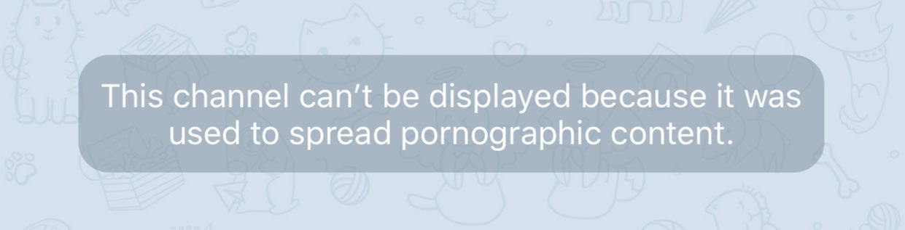
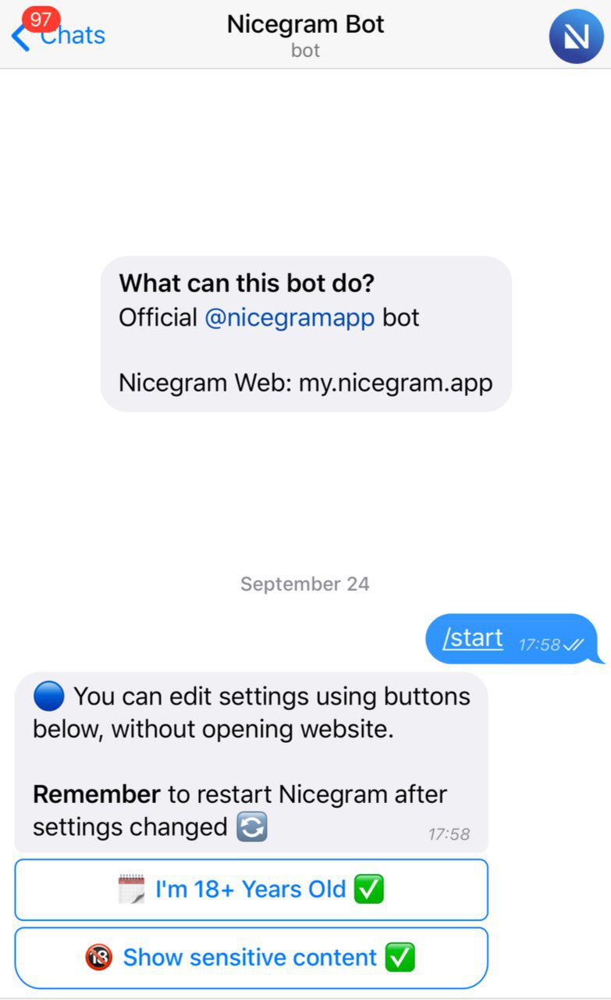
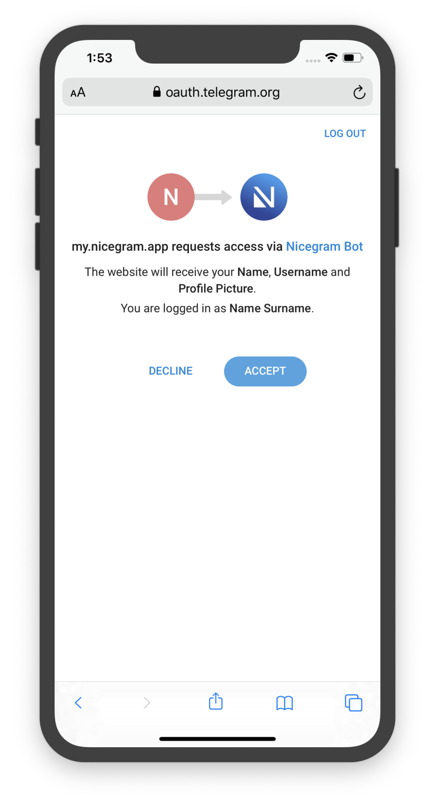
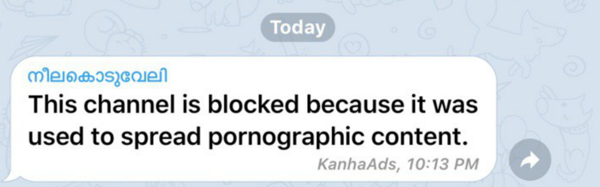

# Nicegram Chat Unblock Guide
_Bloccato con questo messaggio? Nicegram può aiutare!_

Grazie a Nicegram è possibile visualizzare alcune chat (gruppi, bot, canali) bloccate su iOS.
A causa delle linee guida di App Store, la procedura di sblocco deve essere eseguita al di fuori dell’app.

Esistono tre modi per farlo: vediamo come!

Puoi scaricare Nicegram o verificare se sono disponibili nuove versioni su [AppStore](https://itunes.apple.com/app/id1457369322)

## 1. Sblocco tramite bot

1.  Apri [@Nicegram_bot](https://t.me/nicegram_bot) con l’app ufficiale di [Telegram](https://apps.apple.com/us/app/telegram-messenger/id686449807?uo=4) o via [Web](https://web.telegram.org/). (Non puoi aprire il bot con Nicegram!)
2.  Tocca i due bottoni per attivarli
3.  Apri il [multitasking](https://support.apple.com/it-it/HT202070) e chiudi l’app di Nicegram
4.  I contenuti bloccati sono ora visualizzabili!

> Il bot è avviabile solo con l’app ufficiale di [Telegram](https://apps.apple.com/us/app/telegram-messenger/id686449807?uo=4) o via [Web](https://web.telegram.org/). (Non puoi avviare il bot con Nicegram!)

## 2. Tramite sito

1.  Apri https://my.nicegram.app su Safari o su un altro browser (non su Nicegram)
2.  Esegui il login toccando Login with Telegram (N.B il sito non può accedere a dati personali come il numero di telefono o i messaggi = l’operazione è sicura)
3.  Abilita le due spunte e tocca Save
4.  Apri il [multitasking](https://support.apple.com/it-it/HT202070) e chiudi l’app di Nicegram
5.  I contenuti bloccati sono ora visualizzabili!

> il sito non può accedere a dati personali come il numero di telefono o i messaggi.

> Impostazioni salvate. Apri il [multitasking](https://support.apple.com/it-it/HT202070) e chiudi l’app di Nicegram!

## 3. Tramite sito & bot

_Utile se il login con il widget di Telegram non funziona per te._

1.  Apri [@Nicegram_bot](https://t.me/nicegram_bot) con l’app ufficiale di [Telegram](https://apps.apple.com/us/app/telegram-messenger/id686449807?uo=4) o via [Web](https://web.telegram.org/). (Non puoi aprire il bot con Nicegram!)

<aside>OPPURE</aside>

1.   Apri questo messaggio: [https://t.me/nicegramchat/35207](https://t.me/nicegramchat/35207)
2.   Accedi istantaneamente con questo bottone: “🆖Nicegram Login” button
3.   Cambia impostazioni e salva
4.   Apri il [multitasking](https://support.apple.com/it-it/HT202070) e chiudi l’app di Nicegram

### Additional Notes

* Esistono alcune chat bloccate globalmente da Telegram: non esiste alcun modo di sbloccarle.
* Gli utenti con numeri di telefono cinesi, indiani, del Kazakhistan o dell’Uzbekistan non possono accedere ad alcuni contenuti a causa di un blocco regionale da parte di Telegram. L’unico modo per accedere a queste chat è quello di utilizzare un numero di telefono di nazionalità differente oppure un numero di un servizio VoIP.
	
* Se sei il proprietario di un canale che ha subito uno di questi due blocchi contatta Telegram!

### “Unavailable in Nicegram”

Alcune chat possono essere inaccessibili a causa delle regole di App Store: non esiste alcun modo di sbloccarle.

> Scusate

Ami questa feature? Puoi donare a Nicegram! [https://patreon.com/nicegram](https://patreon.com/nicegram)

[Altre caratteristiche di Nicegram](/features)

Scarica [Nicegram dall'AppStore](https://itunes.apple.com/app/id1457369322)

Non dimenticate di unirvi al [canale di Nicegram](https://t.me/nicegramapp) per gli ultimi aggiornamenti e approfondimenti. Unisciti al [gruppo di Nicegram](https://t.me/nicegram_it) per discutere dell'app e condividere i tuoi pensieri sulle nuove funzionalità che vuoi suggerire.
