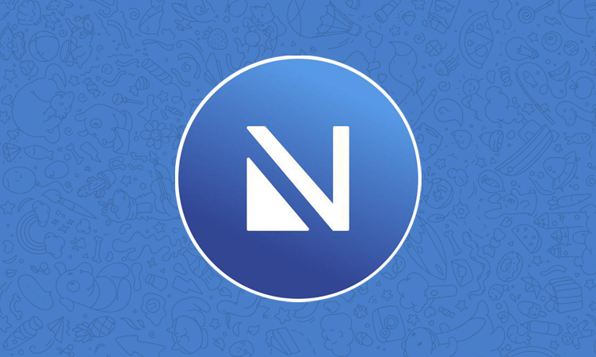

# Nicegram FAQ
_Burada Nicegram - iOS için düzenlenmiş Telegram uygulaması - hakkında sık sorulan sorulara cevaplar var. Sorunuza cevap bulamadıysanız, lütfen bize_ [_@NicegramChat_](https://t.me/nicegramchat) grubundan ulaşın.

## İçindekiler

*   [Nicegram özellikleri](#nicegram-resmi-telegram-uygulamasından-farklı-olarak-hangi-özellikleri-sunuyor)
*   [İndir](#i̇ndir)
*   [Topluluk (sohbetler & kanallar)](#topluluk-sohbetler-ve-kanallar)
*   [Engel kaldırma](#engellenmiş-sohbetlere-nasıl-erişilir)
*   [Nicegram Debug çalışmıyor](#nicegram-debug-neden-artık-çalışmıyor)
*   [Nicegram nasıl yeniden başlatılır?](#nicegramı-nasıl-yeniden-başlatırım)
*   [Nicegram Özelliği Öner](#nasıl-yeni-özellik-önerilir)
*   [Hatalar](#nicegramda-bir-hatayı-nasıl-bildiririm)
*   [Bildirimden yanıtla veya Resim önizleme çalışmıyor](#neden-resimlerin-önizlemesini-göremiyor-veya-bildirimden-yanıtlayamıyorum)
*   [Apple Watch Uygulaması eksikliği](#neden-nicegram-için-apple-watch-uygulaması-yok)
*   [MacOS için Nicegram](#macos-için-nicegramı-nasıl-alırım)
*   [Android için Nicegram](#android-için-nicegramı-nasıl-alırım)
*   [Nicegram BETA](#testflight-betadan-neden-kaldırıldım)
*   [Nicegram Güncellemesi ne zaman?](#neden-nicegram-telegramdan-en-yeni-güncellemelerle-güncellenmiyor)
*   [Gizlilik Politikası](#gizlilik-politikası)
*   [Kaynak Kodu](#kaynak-kodu)
*   [Nicegram'ı Çevirin](#nicegramı-çevirin)
*   [Bağış Yapın](#bağış-yapın)
*   [Bağlantılar](#bağlantılar)

## Nicegram, resmi Telegram uygulamasından farklı olarak hangi özellikleri sunuyor?

*   Sohbetlerinizi filtrelemek için yapılandırılabilir sohbet sekmeleri: Yönetici, Botlar, Kanallar, Gruplar, Kullanıcılar, Okunmamış, Sessize Alınmış
*   Sohbetler için klasörler
*   Yazar olmadan iletme
*   Engellenmiş sohbet & kanalların engelini kaldırma
*   Kullanılmayan sekmeleri gizleme
*   7 hesaba kadar kullanım
*   Gizli sohbet başlatmadan, kişi bilgisi paylaşmadan ve aramadan önce onay
*   Dahili Basitleştirilmiş ve Geleneksel Çince çeviriler
*   Bağlantıları harici tarayıcılarda açma: Chrome, Yandex, DuckDuckGo, Alook ve daha fazlası

Daha fazla özellik için, lütfen [Nicegram ile Tanışın](/tr/features) makalesini okuyun

> [_Yukarı dön_](#i̇çindekiler)

## İndir

*   AppStore - [https://itunes.apple.com/app/id1457369322](https://itunes.apple.com/app/id1457369322)
*   TestFlight [BETA] - [https://testflight.apple.com/join/e07wV6pl](https://testflight.apple.com/join/e07wV6pl)
*   IPA [SADECE Jailbreak!] - [https://t.me/joinchat/AAAAAFZneJeI_zyyNQ3ovQ](https://t.me/joinchat/AAAAAFZneJeI_zyyNQ3ovQ)

> [_Yukarı dön_](#i̇çindekiler)

## Topluluk Sohbetler ve Kanallar

Sohbet ve kanalların [listesi](/chats)

> [_Yukarı dön_](#i̇çindekiler)

## Engellenmiş sohbetlere nasıl erişilir?

Sohbetlere erişmek için [engel kaldırma rehberini](/tr/unblock) takip edin.

> [_Yukarı dön_](#i̇çindekiler)

## Nicegram Debug neden artık çalışmıyor?

Apple bu özelliği öğrendi ve Nicegram'ı [AppStore Kurallarına](https://developer.apple.com/app-store/review/guidelines/) uymaya zorladı.

Lütfen yukarıdaki [engel kaldırma yöntemini](#Engellenmiş-sohbetlere-nasıl-erişilir) kullanın, debug mod ile aynı şekilde çalışıyor.

> [_Yukarı dön_](#i̇çindekiler)

## Nicegram'ı nasıl yeniden başlatırım?

Tabiki... uygulamadan çıkmak için kaydırın ve tekrar açın.

> [_Yukarı dön_](#i̇çindekiler)

## Nasıl yeni özellik önerilir?

[vote.nicegram.app](https://vote.nicegram.app/) websitesini kullanın.

Lütfen Onaylı ve Reddedilen isteklere bakın. Birden fazla önermeyin!

NG'de görmek istediğiniz özellikleri beğenin.

[Telegram API Kullanım Koşulları'na](https://core.telegram.org/api/terms) veya [AppStore Kuralları'na](https://developer.apple.com/app-store/review/guidelines/) karşı gelen herhangi bir özellik (çevrimiçi durumu gizleme, silinen mesajları görme) reddedilecek!

> [_Yukarı dön_](#i̇çindekiler)

## Nicegram'da bir hatayı nasıl bildiririm?

Nicegram'daki hataların çoğu, resmi Telegram uygulamasındaki hatalardır.

Bu yüzden lütfen, klasörler, sekmeler vb. gibi **SADECE NICEGRAM İLE İLGİLİ ÖZELLİKLERDE** deneyimlenen hataları bildirin.

Bazı sebepler nedeniyle Nicegram şunlar gibi kontrolü altında olmayan hatalara sahip:

*   Bildirimden yanıtlanamıyor veya medya önizlemesi görülemiyor. ([ÇÖZÜLDÜ](#Neden-resimlerin-önizlemesini-göremiyor-veya-bildirimden-yanıtlayamıyorum))
*   **Rastgele çökmeler**
*   Telegram aramaları arkaplanda çalışmıyor.
*   Nicegram sohbet yenilemesi çok uzun ve arkaplanda yenilemiyor.
*   Uygulama arkaplandayken canlı konumum güncellenmiyor.
*   Nicegram arkaplanda mesaj gönderemiyor.
*   Mesaj okundu/silindi ise bildirimler gitmiyor.
*   Resmi uygulama iyiyken, Nicegram bağlantıları çok uzun sürüyor (burada ayrıca vekil sunucu kullanmayı deneyebilirsiniz).
*   Sohbetten ayrılmak sohbet bilgisinden imkansız (Sohbet listesi aracılığıyla ayrılabilirsiniz.)

Bulduğunuz sorun yukarıda yoksa, aşağıdaki kriterlere uygun olarak [Nicegram grubuna](https://t.me/nicegramchat) mesaj gönderin. 

1.  #bug etiketi.
2.  Hatanın kısa ama tam açıklaması. (Ayrıca hatayı gösteren bir resim ya da videoda gönderebilirsiniz.)
3.  Kullandığınız iOS sürümü nedir (13.1.3, 12.4.1 vb.).
4.  Kullandığınız Nicegram sürümü nedir (5.11, 5.10 vb.).
5.  Kullandığınız Nicegram'ın inşa numarası nedir (66 vb.).

Nicegram'ın sürüm ve inşa numaralarını ayarlar ikonuna 10 kez hızlıca dokunup ekranı aşağıya kaydırarak bulabilirsiniz. Bunları `com.nicegram.Telegram-iOS` ve `X.XX (YY)` görmelisiniz. 

`X.XX` sürüm numarasıdır. `(YY)` inşa numarasıdır.

> [_Yukarı dön_](#i̇çindekiler)

## Neden resimlerin önizlemesini göremiyor veya bildirimden yanıtlayamıyorum?

Telegram’ın sunucularında, yalnızca Nicegram gibi resmi olmayan bir uygulama kullanırken ortaya çıkan hatalar var. Bu hatalardan biri özellikle can sıkıcıdır: herhangi biri bir grupta mesaj gönderdiğinde, grup sessiz olsa bile “Yeni bir mesajınız var!” diyen bir uyarı mesajı alacaksınız. Bu sorunu çözmek için Nicegram'ın “İstenmeyen Bildirimleri Devre Dışı Bırakın” olarak adlandırılan bir ayarı (varsayılan olarak `açık`) vardır. Bildirim yanıtlama ve bildirim önizlemelerinin çalışma şekli nedeniyle, bu olası istenmeyen bildirimleri devre dışı bırakmak da bu özellikleri devre dışı bırakır.

Fazladan bildirimleri umursamıyorsanız, Nicegram'da bu ayarı kapatabilirsiniz **Ayarlar → Nicegram → İstenmeyen Bildirimleri Devre Dışı Bırakın**. Ayarın etkili olması için telefonunuzu yeniden başlatmanız gerekir. (Apple'ın saatlik veya yeniden başlatırken gönderdiği Apple Push Bildirim Hizmeti için yeni bir yapılandırma almayı içerir.)

> [_Yukarı dön_](#i̇çindekiler)

## Neden Nicegram için Apple Watch Uygulaması yok?

Geliştirici şu anki sistemi kullanarak onu derleyemiyor. Uygun makine ve testler için gerçek Apple Watch almak için 2-3 bin dolarlık bir bağış gerekli. (simülasyon yeterli değil).  
Ayrıca Watch uygulaması süper değiştirilebilir değil.

> [_Yukarı dön_](#i̇çindekiler)

## MacOS için Nicegram'ı nasıl alırım?

MacOS için Nicegram yok. [Resmi kaynakları](https://github.com/overtake/TelegramSwift) kullanarak yapmak daha iyi. Geliştiricinin şimdilik MacOs sürümü için bir planı yok, üzgünüz.

> [_Yukarı dön_](#i̇çindekiler)

## Android için Nicegram'ı nasıl alırım?

Nicegram sadece iOS için mevcut. Başka bir Android Telegram uygulaması istiyorsanız, [Play Store'da](https://play.google.com/store/search?q=Telegram&c=apps) birkaç alternatif var. İnsanlar [Plus Messenger'ı](https://play.google.com/store/apps/details?id=org.telegram.plus&hl=en_US) seviyor gibi görünüyor.

> [_Yukarı dön_](#i̇çindekiler)

## TestFlight betaya neden katılamıyorum?

TestFlight betaları 10,000 testçi ile sınırlıdır. Muhtemelen tüm beta yerleri doludur. Eğer birkaç gün sonra yeni yerler açılmazsa, [Nicegram grubunda](https://t.me/nicegramchat) TestFlight betanın dolu olduğunu ve katılmak istediğinizi bildirin. Geliştirici yakınlarda güncelleme yapmayan testçileri temizleyecek, böylece yeni testçiler katılabilir.

> [_Yukarı dön_](#i̇çindekiler)

## TestFlight betadan neden kaldırıldım?

Nicegram için beta yerleri fazla talep görüyor. Yakınlarda betanızı güncellemediyseniz, geliştici sizi diğerlerinin katılabilmesi için atacak.

> [_Yukarı dön_](#i̇çindekiler)

## Neden Nicegram Telegram'dan en yeni güncellemelerle güncellenmiyor?

Nicegram genel olarak resmi Telegram uygulamasının bir kopyasıdır. Bununla birlikte, resmi uygulamayı yapan geliştiriciler, Nicegram’ın hoş özelliklerini bozacak şekilde sürümlerini sık sık değiştiriyor. Bilerek yaptıklarını düşünmüyoruz; uygulama yazmak zordur. Geliştiricimiz, resmi Telegram uygulamasında yapılan yeni değişikliklerin Nicegram’a mümkün olan en kısa sürede dahil edilmesini sağlamak için elinden geleni yapıyor.
Sadece bekleyin.

> [_Yukarı dön_](#i̇çindekiler)

## Gizlilik Politikası

Nicegram yeterince güvenlidir. Ama incelemek isterseniz, bağlantı burada[  
https://nicegram.app/privacy-policy](https://nicegram.app/privacy-policy)

TL;DR - Nicegram, Telegram API tabanlı bir uygulamadır. Nicegram kötü olmaz ve hassas verilerinizi takip etmez, depolamaz ve paylaşmaz.  

[my.nicegram.app](https://my.nicegram.app/) websitesini veya [@Nicegram_bot](http://t.me/Nicegram_bot)'u kullanıyorsanız, sadece herkese açık olan verilerinizi Nicegram'a veriyorsunuz, bu yüzden uygulama websitesinde ayarladığınız ayarlarınızı getirebiliyor.

> [_Yukarı dön_](#i̇çindekiler)

## Kaynak Kodu

[https://github.com/nicegram](https://github.com/nicegram) adresinde incelemek için özgürsünüz.

> [_Yukarı dön_](#i̇çindekiler)

## Nicegram'ı Çevirin

[Çeviri Rehberi](/translate)

Poeditor.com - [https://poeditor.com/join/project/tiFNs5DvZp](https://poeditor.com/join/project/tiFNs5DvZp)

> [_Yukarı dön_](#i̇çindekiler)

## Bağış Yapın

Patreon - [https://www.patreon.com/nicegram](https://www.patreon.com/nicegram)

Diğer yollar - [@Kylmakalle](https://t.me/Kylmakalle) (Geliştirici)

> [_Yukarı dön_](#i̇çindekiler)

## Bağlantılar

_Burada bir şeyler olacak_

> [_Yukarı dön_](#i̇çindekiler)
