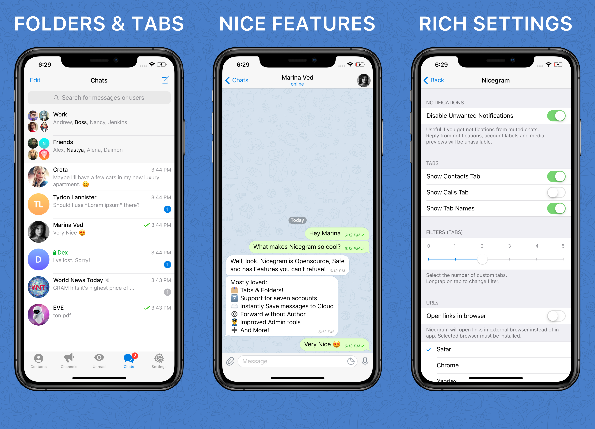

# Nicegram ile Tanışın

Nicegram'a hoş geldiniz – hızlı, güvenli ve iyi mesaşlaşma uygulaması. Reddetmeyeceğiniz yepyeni bir deneyim düzeyi sunan güçlü **Telegram API**, dikkatli **kod optimizasyonu** ve **benzersiz özelliklerin** karışımını hayal edin!

## Nicegram saf iletişim eğlencesini size geri veriyor:

- **Gereksiz sansürü unutun.** Birisi hangi grup, kanal veya botlarla etkileşime girmeniz veya girmemeniz gerektiğini daha iyi bilen bir durumda olmayacak. [Daha fazla oku](/tr/unblock)

- **Klasör & Sekmeler ile daha fazla odaklanın.** Grup sohbetlerini istediğiniz konuya göre gruplayın ya da türe göre ayırın - kanallar, botlar, özel ve daha fazlası. Mesajlaşma alanlarında üretken olun! Klasör oluşturmak için: Sol Köşe - **Düzenle > Yeni Klasör**

- **Yazar olmadan iletme**

- **Kullanılmayan sekmeleri gizleme.** Decide whether you need to hide or show Contacts and Calls tabs at the bottom of your app.

- **Yedi hesap arasında geçiş** Standart Telegram uygulamasında sınırlı olan çoklu hesaplar artık üçten fazla.

- **Mesajları anında kaydete** tek dokunuşla bulutunuza.

- **Sabiti kaybet, ama sonsuza dek değil.** Herhangi bir sohbette gizlenmiş sabit mesajı geri getirin, artık mümkün.
Siz bir yöneticisiniz ve sinirlerinizde çalan sabit mesajdan kurtulmak mı istiyorsunuz? Sadece kendiniz için gizleyebilirsiniz, herkes için değil.

- **Patron gibi yönetici.** Kullanıcıları bir mermiden daha hızlı kısıtlayın. Bir mesaja uzun dokunun ve bir istisna menüsüne ilerleyin. İstisna süresini ikinciye kadar kontrol edin.

- **Nicegram sadece İYİ değil. Onu kullanmak GÜVENLİ.** Sadece benim sözümü dikkate almayın. Gidin ve kaynak kodunda kendiniz kontrol edin: [https://github.com/nicegram](https://github.com/nicegram)

### Nicegram ayrıca bu özelliklere sahip:
- "Geçmişi okumayı atla" - sohbetlerde "okundu" işareti göndermeyin. Debug menüsünden aktif edin, ayarlar ikonuna 15 kez dokunun, aşağıya kaydırın.
- Gizli sohbet başlatmadan, kişi bilginizi paylaşmadan ve aramadan önce onay.
- Dahili Basitleştirilmiş ve Geleneksel Çince çeviriler.
- Bağlantıları harici tarayıcıda açma: Chrome, Yandex, DuckDuckGo, Alook, Opener ve daha fazlası.
- Herhangi bir bağlantı, kullanıcı adı, telefon numarası kullanıcıların hakkında kısmında tıklanabilir
- Sohbet bilgisinde ID'yi gösterme
- Ayarlar menüsünde telefon numarası gizleme
- Vekil sunucu sponsoru kanalları gizleme (Evet, resmi uygulamada da mevcut, ama Nicegram daha kolay yaptı)

Bu özellikleri sevdiniz mi?

Nicegram'a bağış yapabilirsiniz! [https://patreon.com/nicegram](https://patreon.com/nicegram)

[Nicegram'ı AppStore'da](https://itunes.apple.com/app/id1457369322) indir

Son güncellemeler için [Nicegram kanalına](https://t.me/nicegramapp) abone olmayı unutmayın. Uygulamayı tartışmak ve önermek istediğiniz yeni **iyi** özellikler hakkında düşüncelerinizi paylaşmak için [Nicegram grubuna](https://t.me/nicegramchat) katılın.
