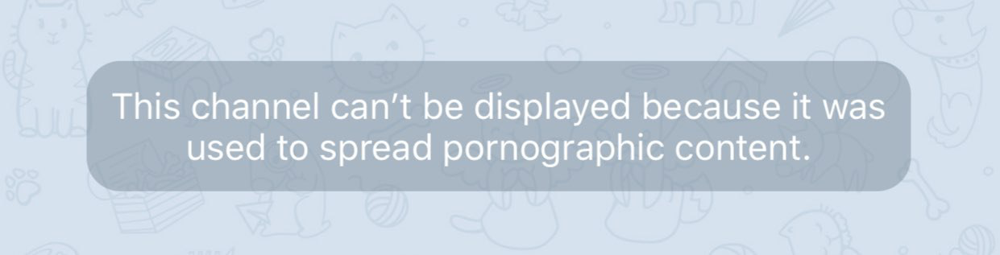

# Nicegram Chat Unblock Guide
_Stuck at this message? Nicegram can help._

You can access certain unavailable chats in Nicegram.  
Due to [App Store Guidelines][app-store-guidelines], you must enable this setting outside of the Nicegram app.

There are **three** ways to do this.

This guide only works for **Nicegram 5.11 (59)** and later! If you’re using an older version, [download or update Nicegram from the App Store][nicegram-app-store].

## 1. Via Telegram Bot

1.   Open [@Nicegram_bot](https://t.me/nicegram_bot) using any official Telegram app (including [web.telegram.org](https://web.telegram.org)). **You cannot open the bot in Nicegram due to App Store Guidelines!**
2.   Tap the buttons to change your settings.
3.   [Restart Nicegram][force-close] (kill and reopen the app).

> The bot is available **only** via official Telegram app or [Telegram Web](https://web.telegram.org).

## 2. Via Nicegram Website

1.   Go to [https://my.nicegram.app](https://my.nicegram.app/).
2.   Login using “Login with Telegram” widget.  
    The Nicegram website can’t access your private data like your phone number or your messages.
3.   Toggle the switches to change your settings.
4.   Tap Save.
5.   [Restart Nicegram][force-close] (kill and reopen the app).

> The Nicegram website only sees your Name, Username, and Profile Picture.

> Settings saved. Remember to [restart Nicegram][force-close]!

## 3. Via Nicegram Website & Bot

_Useful if the web Telegram Widget does not work for you._

1.   Open [@Nicegram_bot](https://t.me/nicegram_bot) using official Telegram app or Web. **You cannot open the bot in Nicegram due to App Store Guidelines!**

<aside>OR</aside>

1.   Open this message with login button: [https://t.me/nicegramchat/35207](https://t.me/nicegramchat/35207)
2.   Instantly login to the website using “🆖Nicegram Login” button
3.   Change settings and Save
4.   [Restart Nicegram][force-close] (kill and open app)

### Additional Notes

* These settings only affect one account.  **If you use multiple accounts** and want to see sensitive content in all of them, **you need to repeat these steps for each account.**
* The “Nicegram Debug” option from older versions is no longer used. You do not need to tap quickly on the settings icon. Nicegram automatically syncs your settings on start.
* Some chats may be blocked globally by Telegram—there’s no way to unblock them.
* Users from China, India, Kazakhstan, Uzbekistan and others can face **region blocks**. To access region-blocked chats, you need to create account with a phone number from an unblocked region. One way to do this is with a <abbr title="Voice over Internet Protocol">VoIP</abbr> number. To find out how to do this, [Google it](https://www.google.com/search?q=voip+number+for+telegram). Here’s what it looks like when a chat is region blocked:
	
* If you’re an owner of a region-blocked chat/bot/channel, contact Telegram support. Nicegram can’t help you.  

### “Unavailable in Nicegram”

Some chats may be inaccessible even in Nicegram due to the [App Store Guidelines][app-store-guidelines]. These chats are blocked with the message “Unavailable in Nicegram.”

> Sorry about that.

Love this feature? You can donate to Nicegram! [https://patreon.com/nicegram](https://patreon.com/nicegram)

Download [Nicegram in the App Store][nicegram-app-store]

[More Nicegram Features](/features)

Don’t forget to subscribe to the [Nicegram channel](https://t.me/nicegramapp) for the latest updates and insights. You can also join the [Nicegram Chat](https://t.me/nicegramchat) to discuss the app and share your thoughts about new **nice** features.

[app-store-guidelines]: https://developer.apple.com/app-store/review/guidelines/#user-generated-content
[nicegram-app-store]: https://itunes.apple.com/app/id1457369322
[force-close]: https://support.apple.com/en-us/HT201330
